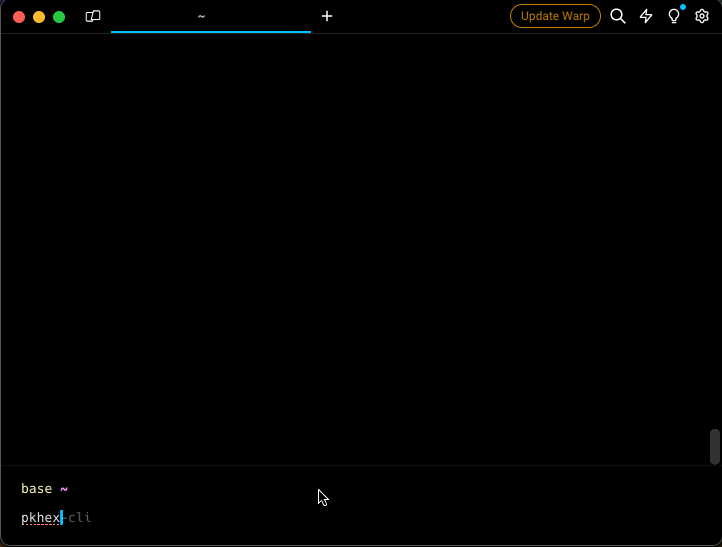

# PKHeX CLI

This is a cross platform Command Line Interface (CLI) tool for interacting with Pokémon save files. It provides various functionalities to manage and modify Pokémon save data.



## Features

- **Load Save File**: Load a Pokémon save file from a specified path.
- **View Trainer Info**: View information about the trainer in the save file.
- **View/Edit Inventory**: View and edit the inventory of the trainer.
- **View/Edit Party**: View and edit your party.
- **View/Edit Pokemon Box**: View and edit all pokemons in your box.
- **Backups**: When exiting the program, if changes were made, a backup will be created.

## Installation

### Homebrew (MacOS/Linux)

```bash
brew tap arleypadua/homebrew-pkhex-cli
brew install pkhex-cli
```

### Script (MacOS/Linux)

```bash
curl -sL https://raw.githubusercontent.com/arleypadua/PKHeX.CLI/main/install.sh | sudo bash
```

#### Compatibility with batocera

PKHeX.CLI is compatible with batocera:

1. Make sure you can access batocera with SSH. [(Details here)](https://wiki.batocera.org/access_the_batocera_via_ssh).
2. Open an ssh session: `ssh root@batocera` the default password is usually `linux`
3. run `curl -sL https://raw.githubusercontent.com/arleypadua/PKHeX.CLI/main/install.sh | bash`
   * _note that because we are accessing as `root` there's **no need** to run `sudo bash`_
4. You should be able to use it as stated [here](https://github.com/arleypadua/PKHeX.CLI?tab=readme-ov-file#usage).

### Chocolatey (Windows)

1. Make sure `chocolatey` is [properly installed](https://chocolatey.org/install#individual)
2. Open `powershell` as administrator
3. Run the following:

```powershell
choco install pkhex-cli
```

### Manual download

1. Download the latest version for your system [here](https://github.com/arleypadua/PKHeX.CLI/releases)
2. Put the file somewhere that's visible from your PATH directory

### Verify the installation with

```bash
pkhex-cli --version
```

should print out

```bash
PKHeX CLI: x.y.z
```

## Usage

```bash
pkhex-cli /path/to/savefile.bin
```

### Command Line Options

- **savefile**: (Optional) The path to the save file. Defaults to "./data/savedata.bin".
- **--version**: Shows the version

## Building

### Prerequisites

- .NET Core SDK 8.x

### Steps

1. Clone this repository to your local machine.
2. Navigate to the project directory.
3. Compile the program using `dotnet build`.
4. Run the program using `dotnet run -- [options]`.

Example

```bash
dotnet run --project ./src/PKHeX.CLI ./src/PKHeX.CLI/data/savedata.bin
```

## Releasing

1. Go to the [Release](https://github.com/arleypadua/PKHeX.CLI/actions/workflows/release.yml) workflow
2. Choose whether it is a `major`, `minor` or `patch` bump
3. Run it
4. By the end of the workflow, you should have a new [Release](https://github.com/arleypadua/PKHeX.CLI/releases/latest)

# Credits

This CLI tool utilizes the following libraries:

* [PKHeX.Core](https://github.com/kwsch/PKHeX/tree/master) for interacting with Pokémon save files.
* [Spectre.Console](https://github.com/spectreconsole/spectre.console) for enhancing the command line interface.
